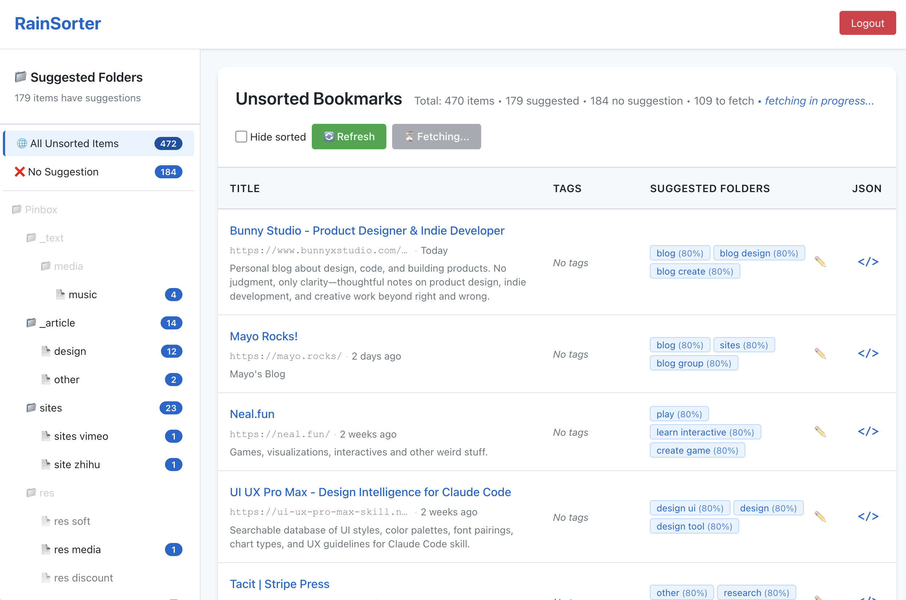

# 🌧️ RainSorter

> AI-powered tool to help you organize your Raindrop.io bookmarks efficiently

[](https://vercel.com/new/clone?repository-url=https%3A%2F%2Fgithub.com%2Fthevertexlab%2FRainSorter&env=VITE_RAINDROP_CLIENT_ID,VITE_REDIRECT_URI,VITE_PROXY_API_URL,RAINDROP_CLIENT_ID,RAINDROP_CLIENT_SECRET&envDescription=Raindrop.io%20OAuth%20credentials%20and%20deployment%20URLs&envLink=https%3A%2F%2Fgithub.com%2Fthevertexlab%2FRainSorter%23environment-variables&project-name=rainsorter&repository-name=rainsorter)
[](LICENSE)

RainSorter is an open-source web app that helps you sort through your unsorted Raindrop.io bookmarks. It uses Raindrop's built-in AI to suggest which folder each bookmark belongs to, and lets you move them with a single click.

**Perfect for when you have hundreds of unsorted bookmarks and need help organizing them!**



---

## ✨ Try It

| | |
|---|---|
| 🌐 **Public instance** | **[rainsorter.vercel.app](https://rainsorter.vercel.app)** — free to use, login with your own Raindrop.io account |
| 🚀 **Self-host on Vercel** | [One-click deploy your own instance](#-deploy-on-vercel) — requires your own Raindrop OAuth app |
| 💻 **Run locally** | [Local development guide](#-local-development) — for developers who want to hack on the code |

---

## Why Use RainSorter?

- 📚 **Bulk Organization**: Sort through all your unsorted bookmarks in one place
- 🤖 **AI-Powered**: Get smart folder suggestions based on bookmark content
- 🔍 **Quick Review**: See all items in existing folders while sorting
- ↩️ **Easy Revert**: Made a mistake? Easily undo all changes (see below)
- 🏷️ **Tagged Sorting**: Special tags track what you've sorted, so you can always revert

---

## 🚀 Deploy on Vercel

Host your own private instance in ~5 minutes. No credit card required.

### Step 1: Create a Raindrop.io OAuth App

1. Go to [raindrop.io/settings/integrations](https://raindrop.io/settings/integrations)
2. Click **"Create new app"**
3. Add **both** redirect URIs (you can add multiple):
   - `https://your-project.vercel.app/callback` ← your Vercel URL
   - `http://localhost:5173/callback` ← for local development (optional but recommended)
4. Copy your **Client ID** and **Client Secret**

### Step 2: Deploy

Click the button below — Vercel will fork the repo and walk you through setting the environment variables:

[](https://vercel.com/new/clone?repository-url=https%3A%2F%2Fgithub.com%2Fthevertexlab%2FRainSorter&env=VITE_RAINDROP_CLIENT_ID,VITE_REDIRECT_URI,VITE_PROXY_API_URL,RAINDROP_CLIENT_ID,RAINDROP_CLIENT_SECRET&envDescription=Raindrop.io%20OAuth%20credentials%20and%20deployment%20URLs&envLink=https%3A%2F%2Fgithub.com%2Fthevertexlab%2FRainSorter%23environment-variables&project-name=rainsorter&repository-name=rainsorter)

### Environment Variables

Set these in your Vercel project's **Settings → Environment Variables**:

#### Frontend variables (injected at build time)

| Variable | Value | Description |
|---|---|---|
| `VITE_RAINDROP_CLIENT_ID` | `your_client_id` | Your Raindrop OAuth app client ID |
| `VITE_REDIRECT_URI` | `https://your-project.vercel.app/callback` | Must match exactly what you set in Raindrop |
| `VITE_PROXY_API_URL` | `https://your-project.vercel.app/api` | Points to your own serverless API |

#### Backend secrets (server-side only, never exposed to the browser)

| Variable | Value | Description |
|---|---|---|
| `RAINDROP_CLIENT_ID` | `your_client_id` | Same as above — used by the serverless proxy |
| `RAINDROP_CLIENT_SECRET` | `your_client_secret` | **Keep this secret.** Never add a `VITE_` prefix. |

> ⚠️ **Security note:** `RAINDROP_CLIENT_SECRET` is only ever read by Vercel Serverless Functions at runtime — it is never bundled into the frontend JavaScript. This is why we have two separate sets of variables.

### Step 3: Update the Redirect URI

After your first deploy, you'll know your exact Vercel URL. Go back to [raindrop.io/settings/integrations](https://raindrop.io/settings/integrations) and confirm the redirect URI matches precisely.

---

## How to Use

### Main Workflow

1. **View Your Unsorted Items**
   - All unsorted bookmarks load automatically
   - See title, URL, tags, and creation date

2. **Get AI Suggestions**
   - Click **"✨ Fetch Suggestions"** button
   - Wait for AI to analyze your bookmarks (progress shown live)
   - See suggested folders with confidence scores (e.g., "Work (85%)")

3. **Sort Your Bookmarks**

   **Method 1: Click AI Suggestion**
   - Click a suggested folder badge
   - Item moves to that folder
   - Gets tagged with `_rainsorter`

   **Method 2: Manual Selection**
   - Click the **✏️** icon
   - Search or browse full folder tree
   - Select any folder manually
   - Gets tagged with `_rainsorter_manual`

4. **Filter & Review**
   - Click folders in left sidebar to filter view
   - See existing items in selected folder (top panel)
   - Use "Hide sorted" checkbox to hide organized items

### Understanding the Tags

RainSorter adds special tags to help you track and revert changes:

#### `_rainsorter` Tag
- **When**: Automatically added when you click an AI suggestion
- **Means**: "This was sorted using AI suggestions"
- **Why**: So you can easily find and review AI-sorted items later

#### `_rainsorter_manual` Tag
- **When**: Automatically added when you use the ✏️ manual selector
- **Means**: "I manually chose this folder (not AI, not official app)"
- **Why**: Different from AI suggestions, but still tracked for reverting

### Why These Tags Matter

**🔄 Easy Revert**: Made mistakes while sorting? Want to start over?

Just search for items with `_rainsorter` or `_rainsorter_manual` tags in the official Raindrop app, select all, and move them back to Unsorted. All your sorting decisions are reversible!

**📊 Track Your Progress**:
- Items with `_rainsorter` = AI helped you decide
- Items with `_rainsorter_manual` = You decided manually
- No tag = Sorted in official app or pre-existing

---

## Tips & Best Practices

### Sorting Strategy

1. **Start Small**: Click "Fetch Suggestions" to analyze your bookmarks
2. **Trust High Confidence**: Suggestions with 80%+ confidence are usually accurate
3. **Use Manual for Edge Cases**: Use ✏️ when AI suggestion doesn't fit
4. **Review Before Finalizing**: Click folders in sidebar to preview what's already there

### Managing Large Collections

- **Batch Processing**: Suggestions fetch in the background, stats update live
- **Filter by Folder**: Click sidebar folders to focus on specific categories
- **Hide Sorted**: Check "Hide sorted" to see only remaining unsorted items

### Reverting Mistakes

**Option 1: Revert Everything**
```
1. In official Raindrop app, search: #_rainsorter OR #_rainsorter_manual
2. Select all results
3. Move to "Unsorted"
4. Remove tags
```

**Option 2: Revert AI Only**
```
Search: #_rainsorter
Move to Unsorted
(Keeps your manual decisions)
```

**Option 3: Revert Manual Only**
```
Search: #_rainsorter_manual
Move to Unsorted
(Keeps AI suggestions)
```

---

## Features Overview

- ✅ OAuth2 authentication (secure, no password storage)
- ✅ Fetch ALL unsorted bookmarks (no pagination limits)
- ✅ AI-powered folder suggestions with confidence scores
- ✅ One-click sorting to suggested folders
- ✅ Manual folder selector with search
- ✅ Tree-view sidebar with folder hierarchy
- ✅ Preview existing items in folders
- ✅ Real-time suggestion fetching progress
- ✅ Hide sorted items filter
- ✅ Tag-based revert system
- ✅ Full JSON inspector for debugging

---

## FAQ

**Q: Will this delete my bookmarks?**
A: No! It only moves bookmarks between folders and adds tags. Nothing is deleted.

**Q: Can I undo sorting decisions?**
A: Yes! Items are tagged with `_rainsorter` or `_rainsorter_manual`. Search for these tags in the official app and move them back to Unsorted.

**Q: Can I self-host this?**
A: Yes! Click the "Deploy to Vercel" button at the top. You'll need to create a Raindrop.io OAuth app and set five environment variables. See the [Deploy on Vercel](#-deploy-on-vercel) section for a step-by-step guide.

**Q: Is my data safe?**
A: Yes. RainSorter uses Raindrop's official OAuth2 flow — your password is never involved. Your `client_secret` is stored only as a Vercel environment variable and is only ever read by serverless functions at runtime; it is never bundled into the browser JavaScript. Your access tokens are stored in your own browser's localStorage and are never sent to any third-party server.

**Q: Does this work with shared collections?**
A: It works with any collections in your account that you have edit access to.

**Q: Does the public instance store my data?**
A: No. The public instance at [rainsorter.vercel.app](https://rainsorter.vercel.app) only proxies OAuth token exchange. No bookmark data, tokens, or personal information is stored anywhere on the server.

---

## For Developers

### Architecture

RainSorter runs as a **Vite + React SPA** with a small serverless backend whose sole job is to keep `client_secret` off the browser:

```
Browser (React SPA)
  └─→ GET/PUT https://api.raindrop.io/...        (direct, with access_token)
  └─→ POST /api/oauth/token                      (→ Vercel Serverless Function)
  └─→ POST /api/oauth/refresh                    (→ Vercel Serverless Function)
                │
                ▼
        Vercel Serverless (api/)
          └─→ POST https://raindrop.io/oauth/access_token
                (with RAINDROP_CLIENT_SECRET, server-side only)
```

In **local development**, `server-legacy/` (Express on port 3001) replicates this proxy. Port 5173 is the Vite dev server for the frontend.

### Tech Stack

- **Frontend**: Vite + React + Jotai (state management)
- **Production backend**: Vercel Serverless Functions (OAuth proxy, `api/`)
- **Local dev backend**: Express.js (`server-legacy/`, port 3001)
- **API**: Raindrop.io REST API
- **Styling**: Plain CSS (no frameworks)

### Project Structure

```
rainsorter/
├── api/                    # Vercel Serverless Functions (production backend)
│   └── oauth/
│       ├── token.js        # POST /api/oauth/token   – code → access_token
│       └── refresh.js      # POST /api/oauth/refresh – refresh_token flow
├── src/                    # Frontend React app
│   ├── components/         # UI components
│   ├── hooks/              # Custom React hooks
│   ├── pages/              # LoginPage, CallbackPage, DashboardPage
│   ├── services/           # API clients (raindropApi, proxyApi, authService)
│   ├── store/              # Jotai atoms (auth, collections, raindrops, ui)
│   └── utils/              # constants, formatters, storage
├── server-legacy/          # Express OAuth proxy (local development only)
│   └── index.js
├── vercel.json             # Vercel build config + SPA rewrite rules
└── vite.config.js
```

### 💻 Local Development

Local development uses two processes on two ports:

| Process | Port | Command | Role |
|---|---|---|---|
| Vite dev server | **5173** | `npm run dev` | Frontend (React SPA) |
| Express proxy | **3001** | `npm run server` | Local OAuth proxy (replaces Vercel Functions) |

```bash
# Install all dependencies
npm install
cd server-legacy && npm install && cd ..

# Copy and fill in env files
cp .env.example .env
cp server-legacy/.env.example server-legacy/.env
# Edit both files with your Raindrop credentials

# Run both servers together
npm start

# Or separately
npm run dev       # Frontend only (port 5173)
npm run server    # Backend proxy only (port 3001)
```

#### Local `.env` (root)

```
VITE_RAINDROP_CLIENT_ID=your_client_id_here
VITE_REDIRECT_URI=http://localhost:5173/callback
VITE_PROXY_API_URL=http://localhost:3001/api
```

#### Local `server-legacy/.env`

```
RAINDROP_CLIENT_ID=your_client_id_here
RAINDROP_CLIENT_SECRET=your_client_secret_here
FRONTEND_URL=http://localhost:5173
PORT=3001
```

### Key Design Decisions

- **Serverless proxy**: Keeps `client_secret` off the browser — required by Raindrop's OAuth spec
- **`server-legacy/`**: Identical behaviour to the serverless functions, used only when running locally
- **Jotai + localStorage**: Persistent auth state across page refreshes
- **Batched fetching**: 5 concurrent suggestion requests with 500ms delay to respect rate limits
- **Tag-based tracking**: All sorting operations are reversible via `_rainsorter` / `_rainsorter_manual` tags
- **No pagination**: Fetches all unsorted items for a complete single-page view

### API Endpoints Used

- `GET /rest/v1/raindrops/-1` — Fetch unsorted items
- `GET /rest/v1/raindrops/0?search=#tag` — Fetch tagged items
- `GET /rest/v1/raindrop/{id}/suggest` — Get AI suggestions
- `PUT /rest/v1/raindrop/{id}` — Update raindrop (move to folder, add tag)
- `GET /rest/v1/collections` — Get full folder tree

### Contributing

Issues and pull requests welcome! This is a community tool to help Raindrop users.

### License

MIT — Free to use, modify, and distribute.

---

Made with ☕ by Raindrop.io users, for Raindrop.io users
